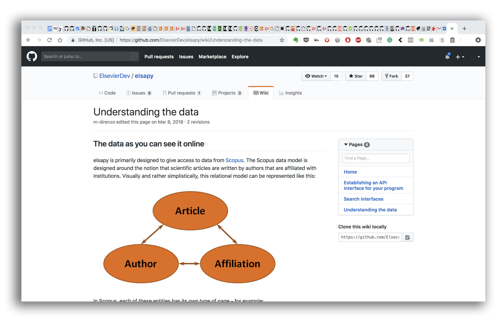

# RATIONALE #

* Good practices on metadata insertion on digital assets, according to guidelines and checklists by Scopus

### What is this repository for? ###

* Quick summary
    - Actions, checklists and procedures applied on xml files, therefore over on metadata datum: gathering data, formatting, internal testings, sorting, _et alia_
	- A systematize-to_do-checklist formula to generate `.xml` files format according [Scopus indexing procedure](https://www.ubijournal.com/scopus-indexed-journals/)

### How do I get set up? ###

* Configuration
    - Check [Colophon.md](Colophon.md)
* Dependencies
    - Up to now, there is no dependencies
* Database configuration
    - `.xml` file format treatment and handling needs some [software](Colophon.md) to apply the recipe
* How to run tests
    - Check [data gathered.md](Data_gathered.md)
* Deployment instructions
    - Check [XML formatting.md](XML_formatting.md)
    - Check [Bibliography.md](Bibliography.md)

### Related repositories ###

* Some repositories linked with this project:
     - [Temas Medievales](https://bitbucket.org/imhicihu/temas-medievales-project/src/)
     - [PDF-Inner structure](https://bitbucket.org/imhicihu/pdf-inner-structure/src/master/)

### Issues ###

* Check them on [here](https://bitbucket.org/imhicihu/scopus-metadata/issues)

### Changelog ###

* Please check the [Commits](https://bitbucket.org/imhicihu/scopus-metadata/commits/) section for the current status

### Who do I talk to? ###

* Repo owner or admin
    - Contact `imhicihu` at `gmail` dot `com`

### Code of Conduct

* Please, check our [Code of Conduct](code_of_conduct.md)

### Legal ###

* All trademarks are the property of their respective owners.

### Licence ###

* The content of this project itself is licensed under the    